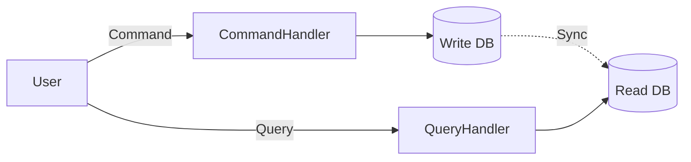

import { Aside } from "@astrojs/starlight/components";

## CQRS nima?

**CQRS** (**C**ommand **Q**uery **R**esponsibility **S**egregation) — bu dastur ichida ma'lumotlarni o'zgartirish (Command) va ma'lumotlarni o'qish (Query) operatsiyalarini bir-biridan butunlay ajratish prinsipidir.

Oddiy CRUD (Create, Read, Update, Delete) dasturlarda bitta model ham o'qish, ham yozish uchun ishlatiladi. CQRS da esa ular alohida.

## Asosiy Tushunchalar

### 1. Commands (Buyruqlar)

Ma'lumotlarni o'zgartiruvchi amallar. Ular hech narsa qaytarmasligi kerak (yoki faqat status/id).

- `CreateUserCommand`
- `UpdateProductPriceCommand`

### 2. Queries (So'rovlar)

Ma'lumotlarni o'qiydigan amallar. Ular ma'lumotlarni hech qachon o'zgartirmasligi kerak (side-effect yo'q).

- `GetUserByIdQuery`
- `GetAllProductsQuery`

## Arxitektura

Ko'pincha CQRS da o'qish va yozish uchun **ikki xil ma'lumotlar bazasi** ishlatiladi:

1.  **Write Database (Master):** Yozish uchun optimallashtirilgan (normalized, 3NF).
2.  **Read Database (Replica/Projections):** O'qish uchun optimallashtirilgan (denormalized, NoSQL).

## Afzalliklari

<Aside type="tip">
  * **Performance:** O'qish va yozishni alohida masshtablash (scaling) mumkin. *
  **Xavfsizlik:** Yozish huquqi va o'qish huquqini alohida boshqarish oson. *
  **Moslashuvchanlik:** Read bazani istalgan ko'rinishda saqlash mumkin
  (masalan, Elasticsearch qidiruv uchun).
</Aside>

## Kamchiliklari

<Aside type="caution">
  * **Murakkablik:** Dastur kodi sezilarli darajada ko'payadi. * **Eventual
  Consistency:** Write bazadan Read bazaga ma'lumot yetib borguncha vaqt o'tadi
  (ms yoki soniyalar). Foydalanuvchi o'zgartirgan narsasini darhol ko'rmasligi
  mumkin.
</Aside>
