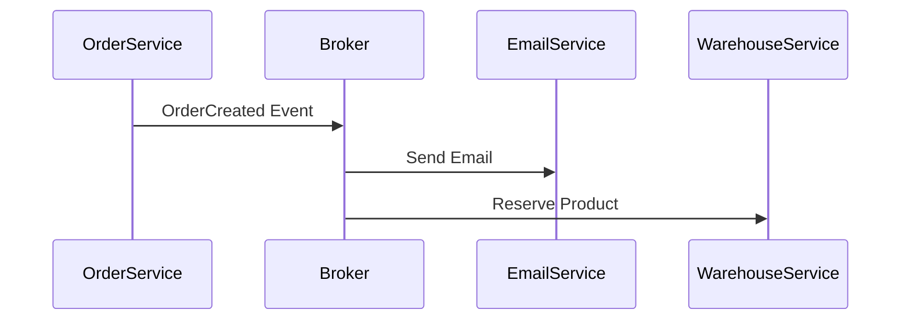

import { Aside } from "@astrojs/starlight/components";

## Event-Driven Architecture (EDA) nima?

**Event-Driven Architecture** — bu dastur komponentlari bir-biri bilan to'g'ridan-to'g'ri (HTTP request kabi) emas, balki **hodisalar (events)** orqali muloqot qiladigan arxitekturadir.

Bu yerda "Event" — tizimda sodir bo'lgan muhim o'zgarish (masalan: "Foydalanuvchi ro'yxatdan o'tdi", "To'lov amalga oshdi").

## Asosiy Komponentlar

1.  **Producer (Ishlab chiqaruvchi):** Hodisani yuzaga keltiruvchi servis. (Masalan, `OrderService`).
2.  **Broker (Vositachi):** Hodisalarni qabul qilib, ularni navbatda saqlovchi va kerakli joyga yetkazuvchi tizim (masalan, **Kafka**, **RabbitMQ**, **Redis**).
3.  **Consumer (Iste'molchi):** Hodisani tinglab turuvchi va unga reaksiya bildiruvchi servis. (Masalan, `NotificationService`).

## Ishlash prinsipi

`OrderService` buyurtma yaratilganda `EmailService`ni ham, `WarehouseService`ni ham chaqirmaydi. U shunchaki "Buyurtma bo'ldi" deb baqiradi (Brokerga tashlaydi). Qolganlar esa buni eshitib, o'z ishini qiladi.

## Afzalliklari

<Aside type="tip">
  * **Decoupling (Ajralish):** Servislar bir-birini umuman bilmaydi. *
  **Asinxronlik:** Bir servis javobini kutib turish shart emas. *
  **Reliability:** Agar `EmailService` o'chib qolsa ham, `OrderService`
  ishlayveradi. `EmailService` yoqilganda xabarlarni Brokerdan olib ishlay
  oladi.
</Aside>

## Kamchiliklari

<Aside type="caution">
  * **Debugging qiyin:** Xatolar zanjirini kuzatish (Distributed Tracing)
  murakkab. * **Murakkablik:** Brokerlarni (Kafka/RabbitMQ) boshqarish va
  sozlash alohida bilim talab qiladi.
</Aside>
