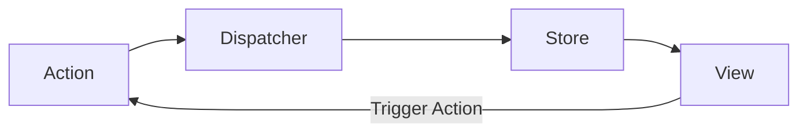

import { Aside } from "@astrojs/starlight/components";

## Flux nima?

**Flux** — bu Facebook tomonidan React ilovalari uchun ishlab chiqilgan arxitektura patterni. Uning asosiy g'oyasi — **Unidirectional Data Flow** (Bir tomonlama ma'lumot oqimi). Bu MVC dagi murakkab va chalkash ma'lumot oqimlarini oldini olishga yordam beradi.

Flux 4 ta asosiy qismdan iborat:

1.  **Actions:** Tizimda sodir bo'ladigan hodisalar (masalan, `ADD_TODO`).
2.  **Dispatcher:** Barcha actionlarni qabul qilib, ro'yxatdan o'tgan Store larga tarqatuvchi markaziy xab (hub).
3.  **Stores:** Ma'lumotlar (State) va logikani saqlaydi.
4.  **Views:** React komponentlari (UI).

## Ishlash tartibi (Flow)

Flux da ma'lumot faqat bitta yo'nalishda harakatlanadi:



1.  **View** foydalanuvchi harakati natijasida **Action** yaratadi.
2.  **Action** **Dispatcher** ga yuboriladi.
3.  **Dispatcher** uni barcha **Store** larga tarqatadi.
4.  **Store** o'ziga kerakli action ni ushlab olib, o'z holatini (state) yangilaydi va o'zgarish haqida xabar beradi (emit change).
5.  **View** (Controller-View) o'zgarishni eshitib, o'zini yangilaydi.

## Redux va Flux

Ko'pchilik Flux ni **Redux** orqali taniydi. Redux — bu Flux g'oyasining eng mashhur implementatsiyasi, lekin u biroz soddalashtirilgan (yagona Store, Dispatcher yo'q).

<Aside type="note" title="Qiziqarli fakt">
  MVC da Model va View o'rtasidagi aloqa ikki tomonlama bo'lib, kattalashganda
  "spagetti" kodga aylanib ketishi mumkin edi. Flux bu muammoni "bir tomonlama
  oqim" orqali hal qildi.
</Aside>

## Amaliy Misol (Redux uslubida)

```javascript
// Action Types
const ADD_TODO = "ADD_TODO";

// Action Creator
function addTodo(text) {
  return { type: ADD_TODO, payload: text };
}

// Reducer (Store logikasi)
function todoReducer(state = [], action) {
  switch (action.type) {
    case ADD_TODO:
      return [...state, action.payload];
    default:
      return state;
  }
}

// Store
function createStore(reducer) {
  let state = reducer(undefined, {});
  const listeners = [];

  return {
    getState: () => state,
    dispatch: (action) => {
      state = reducer(state, action);
      listeners.forEach((fn) => fn());
    },
    subscribe: (fn) => listeners.push(fn),
  };
}

// Foydalanish
const store = createStore(todoReducer);
store.subscribe(() => console.log("State:", store.getState()));
store.dispatch(addTodo("Birinchi vazifa"));
store.dispatch(addTodo("Ikkinchi vazifa"));
// State: ["Birinchi vazifa"]
// State: ["Birinchi vazifa", "Ikkinchi vazifa"]
```
