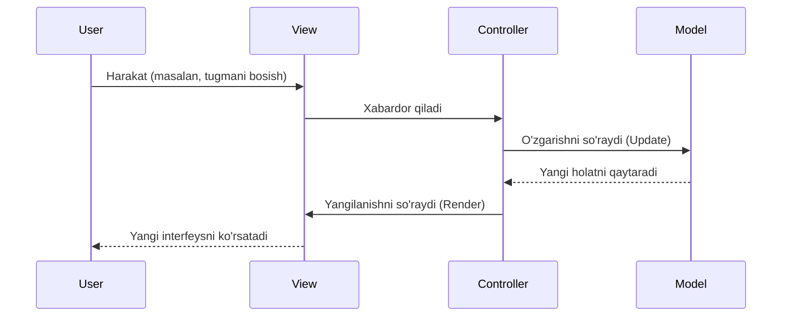

import { Aside } from "@astrojs/starlight/components";

## MVC nima?

**MVC** (**M**odel-**V**iew-**C**ontroller) — bu dasturiy ta'minotni loyihalashda eng ko'p ishlatiladigan arxitektura patternlaridan biri. Uning asosiy maqsadi dasturning **biznes logikasi**ni (ma'lumotlar bilan ishlash) uning **foydalanuvchi interfeysi**dan (ko'rinish) ajratishdir. Bu esa kodni boshqarishni, testlashni va kengaytirishni osonlashtiradi.

MVC uchta asosiy komponentdan iborat:

1.  **Model:** Ma'lumotlar va biznes logika.
2.  **View:** Foydalanuvchiga ko'rinadigan qism (UI).
3.  **Controller:** Model va View o'rtasidagi vositachi.

## Komponentlar

### 1. Model

Model — bu dasturning "miyasi". U ma'lumotlar bazasi bilan ishlaydi, ma'lumotlarni saqlaydi va o'zgartiradi. Model View yoki Controller haqida hech narsa bilmaydi.

- **Vazifasi:** Ma'lumotlarni saqlash, olish, o'zgartirish va biznes qoidalarini tekshirish.
- **Misol:** Foydalanuvchi ma'lumotlari (`User` klassi), tovarlar ro'yxati.

### 2. View

View — bu dasturning "yuzi". U Model dagi ma'lumotlarni foydalanuvchiga qulay ko'rinishda taqdim etadi.

- **Vazifasi:** Ma'lumotlarni ko'rsatish (HTML, CSS).
- **Misol:** Veb-sahifa, tugmalar, jadvallar.

### 3. Controller

Controller — bu Model va View o'rtasidagi "bog'lovchi". U foydalanuvchidan kelgan so'rovlarni (input) qabul qiladi, Modelni yangilaydi va natijani View ga uzatadi.

- **Vazifasi:** Foydalanuvchi harakatlarini (click, input) qayta ishlash va kerakli Model funksiyalarini chaqirish.

## Ishlash tartibi (Flow)



## Afzalliklari va Kamchiliklari

<Aside type="tip" title="Afzalliklari">
  * **Separation of Concerns:** Kod mantiqiy qismlarga bo'lingan. * **Parallel
  Development:** Bir vaqtning o'zida bir dasturchi View ustida, boshqasi Model
  ustida ishlashi mumkin. * **Testlash oson:** Biznes logikani (Model)
  interfeysdan (View) ajratilgan holda testlash mumkin.
</Aside>

<Aside type="caution" title="Kamchiliklari">
  * **Murakkablik:** Kichik loyihalar uchun ortiqcha bo'lishi mumkin. *
  **Controller semirib ketishi:** Vaqt o'tishi bilan Controller juda ko'p
  vazifalarni o'z zimmasiga olishi mumkin ("Massive View Controller" muammosi).
</Aside>

## Frontendda MVC

Zamonaviy frontend freymvorklari (React, Vue, Angular) klassik MVC ga to'liq mos kelmaydi, lekin uning prinsiplaridan foydalanadi. Masalan:

- **Backbone.js** va **AngularJS (1.x)** klassik MVC ga yaqin edi.
- **React** ko'proq **V** (View) ga e'tibor qaratadi, lekin State management (Redux, Context) **M** (Model) vazifasini bajaradi.

## Amaliy Misol (Vanilla JS)

Quyida oddiy MVC yordamida "Todo List" misoli keltirilgan:

```javascript
// Model
class TodoModel {
  constructor() {
    this.todos = [];
  }

  addTodo(text) {
    this.todos.push({ id: Date.now(), text, completed: false });
  }

  getTodos() {
    return this.todos;
  }
}

// View
class TodoView {
  constructor() {
    this.list = document.getElementById("todo-list");
    this.input = document.getElementById("todo-input");
  }

  render(todos) {
    this.list.innerHTML = todos.map((t) => `<li>${t.text}</li>`).join("");
  }

  getInputValue() {
    return this.input.value;
  }

  clearInput() {
    this.input.value = "";
  }
}

// Controller
class TodoController {
  constructor(model, view) {
    this.model = model;
    this.view = view;
    document
      .getElementById("add-btn")
      .addEventListener("click", () => this.addTodo());
  }

  addTodo() {
    const text = this.view.getInputValue();
    if (text) {
      this.model.addTodo(text);
      this.view.render(this.model.getTodos());
      this.view.clearInput();
    }
  }
}

// Ishga tushirish
const app = new TodoController(new TodoModel(), new TodoView());
```
