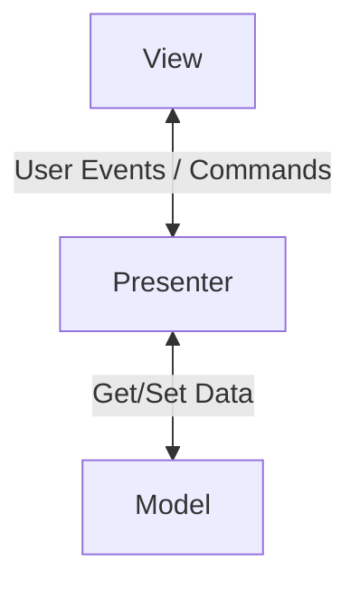

import { Aside } from "@astrojs/starlight/components";

## MVP nima?

**MVP** (**M**odel-**V**iew-**P**resenter) — bu asosan foydalanuvchi interfeysi (UI) bor ilovalarda qo'llaniladigan arxitektura patternidir. U **MVC** ning o'zgargan ko'rinishi bo'lib, View va Model ni butunlay ajratishga qaratilgan.

Asosiy komponentlar:

1.  **Model:** Ma'lumotlar va biznes logika.
2.  **View:** Foydalanuvchi interfeysi (UI). U juda "passiv" bo'ladi.
3.  **Presenter:** Model va View o'rtasidagi vositachi. U View dan hodisalarni qabul qiladi va View ga nima qilishni buyuradi.

## MVC vs MVP: Farqi nimada?

MVC da `Controller` Model ni yangilaydi, lekin `View` ba'zan to'g'ridan-to'g'ri `Model` dan o'zgarishlarni tinglashi mumkin.
MVP da esa **View va Model bir-birini mutlaqo bilmaydi**. Barcha aloqa `Presenter` orqali o'tadi.



- **View** faqat interfeysni chizadi va `Presenter` ga "tugma bosildi" deb xabar beradi.
- **Presenter** biznes logikani bajaradi va `View` ga "matnni o'zgartir" yoki "xabarni ko'rsat" deb buyruq beradi.

## Afzalliklari

<Aside type="tip">
  * **Testlash juda oson:** View interfeys (Interface) sifatida qaraladi,
  shuning uchun Presenter ni View siz (mock object bilan) testlash oson. *
  **Separation of Concerns:** UI va Logika to'liq ajratilgan.
</Aside>

## Kamchiliklari

<Aside type="caution">
  * **Kod ko'payishi:** Har bir View uchun alohida Presenter yozish kerak
  bo'lishi mumkin. * **Murakkablik:** Kichik ilovalar uchun ortiqcha.
</Aside>

## Amaliy Misol (Vanilla JS)

```javascript
// View Interface
class TodoView {
  constructor(presenter) {
    this.presenter = presenter;
    this.input = document.getElementById("todo-input");
    this.list = document.getElementById("todo-list");
    document.getElementById("add-btn").onclick = () =>
      this.presenter.onAddClick();
  }

  getInputValue() {
    return this.input.value;
  }

  showTodos(todos) {
    this.list.innerHTML = todos.map((t) => `<li>${t}</li>`).join("");
  }

  clearInput() {
    this.input.value = "";
  }
}

// Presenter
class TodoPresenter {
  constructor(model) {
    this.model = model;
    this.view = null;
  }

  setView(view) {
    this.view = view;
  }

  onAddClick() {
    const text = this.view.getInputValue();
    if (text) {
      this.model.add(text);
      this.view.showTodos(this.model.getAll());
      this.view.clearInput();
    }
  }
}

// Model
class TodoModel {
  constructor() {
    this.todos = [];
  }
  add(text) {
    this.todos.push(text);
  }
  getAll() {
    return this.todos;
  }
}

// Ishga tushirish
const model = new TodoModel();
const presenter = new TodoPresenter(model);
const view = new TodoView(presenter);
presenter.setView(view);
```
