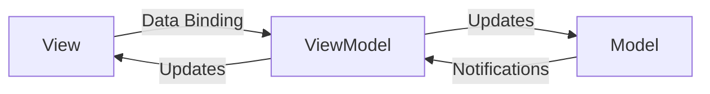

import { Aside } from "@astrojs/starlight/components";

## MVVM nima?

**MVVM** (**M**odel-**V**iew-**V**iew**M**odel) — bu MVC ning takomillashtirilgan versiyasi bo'lib, u asosan UI (User Interface) ni biznes logika va ma'lumotlardan ajratishga qaratilgan. Bu pattern Microsoft tomonidan WPF (Windows Presentation Foundation) uchun ishlab chiqilgan, lekin bugungi kunda zamonaviy frontend freymvorklarining (ayniqsa Vue.js va Angular) asosini tashkil etadi.

MVVM uchta asosiy qismdan iborat:

1.  **Model:** Ma'lumotlar va biznes logika.
2.  **View:** Foydalanuvchi interfeysi (UI).
3.  **ViewModel:** View va Model o'rtasidagi vositachi bo'lib, **Data Binding** orqali ishlaydi.

## Asosiy farqi: Data Binding

MVC dan farqli o'laroq, MVVM da View va ViewModel o'rtasida **ikki tomonlama bog'lanish (Two-way Data Binding)** mavjud. Bu shuni anglatadiki:
-   Model dagi ma'lumot o'zgarsa, View avtomatik yangilanadi.
-   View da foydalanuvchi biror narsani o'zgartirsa (inputga yozsa), Model avtomatik yangilanadi.

## Komponentlar

### 1. Model

Xuddi MVC dagi kabi, bu ma'lumotlar va biznes qoidalarni saqlaydi.

### 2. View

Foydalanuvchiga ko'rinadigan qism. U ViewModel ga bog'langan (bind qilingan) bo'ladi. U faqat ma'lumotni qanday ko'rsatishni biladi, lekin uning qayerdan kelishini bilmaydi.

### 3. ViewModel

Bu View ning abstraksiyasi. U Model dan ma'lumot oladi va uni View tushunadigan formatga o'tkazadi. ViewModel da View ga tegishli hech qanday to'g'ridan-to'g'ri referens (masalan, DOM elementlari) bo'lmaydi.

## Ishlash tartibi



## Frontendda MVVM (Vue.js misolida)

**Vue.js** yoki **Knockout.js** kabi kutubxonalar MVVM patterniga yaqqol misol bo'la oladi.

```javascript
// Model
const data = {
  message: "Salom, Dunyo!"
};

// ViewModel (Vue instance)
const vm = new Vue({
  data: data,
  methods: {
    updateMessage() {
      this.message = "Salom, MVVM!";
    }
  }
});

// View (HTML)
// <div>{{ message }}</div>
```

Bu yerda `this.message` o'zgarganda, HTML dagi matn avtomatik o'zgaradi. Dom bilan qo'lda ishlash (`document.getElementById...`) shart emas.

## Afzalliklari va Kamchiliklari

<Aside type="tip" title="Afzalliklari">
*   **Avtomatlashtirish:** View va Model o'rtasidagi sinxronizatsiya avtomatik bajariladi (boilerplate kod kamayadi).
*   **Testlash:** ViewModel ni View siz alohida testlash oson.
*   **Dizayner va Dasturchi hamkorligi:** Dizayner View (HTML/CSS) ustida, dasturchi ViewModel (JS) ustida bemalol ishlay oladi.
</Aside>

<Aside type="caution" title="Kamchiliklari">
*   **Debugging qiyinligi:** Data binding avtomatik bo'lgani uchun, xato qayerda sodir bo'lganini topish ba'zan qiyin bo'lishi mumkin.
*   **Performance:** Katta ilovalarda juda ko'p watcher va listenerlar ishlash tezligiga ta'sir qilishi mumkin.
</Aside>
