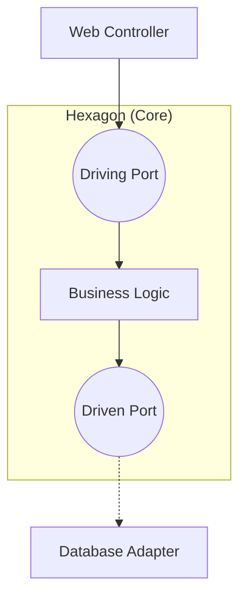

import { Aside } from "@astrojs/starlight/components";

## Hexagonal Architecture nima?

**Hexagonal Architecture** (yoki **Ports and Adapters**) — bu Alistair Cockburn tomonidan taklif qilingan arxitektura bo'lib, uning maqsadi dasturiy ta'minotning yadrosini (biznes logikani) tashqi texnologiyalardan (database, web framework, external API) ajratishdir.

Bu arxitektura Clean Architecture bilan juda o'xshash, lekin u asosiy e'tiborni **Portlar** va **Adapterlar**ga qaratadi.

## Asosiy Tushunchalar

### 1. Core (Yadro)

Eng o'rtada biznes logika joylashgan. U tashqi dunyo haqida hech narsa bilmaydi.

### 2. Ports (Portlar)

Biznes logika bilan muloqot qilish uchun "kirish" va "chiqish" eshiklari. Bular odatda **Interface**lardir.

- **Driving Ports (Inbound):** Dasturga buyruq berish uchun (masalan, `UserServiceInterface`).
- **Driven Ports (Outbound):** Dastur tashqi dunyodan nimanidir so'rashi uchun (masalan, `UserRepositoryInterface`).

### 3. Adapters (Adapterlar)

Portlarni konkret texnologiyalar bilan bog'lovchi qism.

- **Driving Adapters:** Web Controller, CLI, Test cases. (Ular `UserService`ni chaqiradi).
- **Driven Adapters:** PostgreSQL, Redis, MailService. (Ular `UserRepository`ni implement qiladi).

## Diagramma

## Afzalliklari

<Aside type="tip">
  * **Mustaqillik:** Biznes logikani web framework yoki bazasiz testlash oson. *
  **Almashinuvchanlik:** PostgreSQL o'rniga MongoDB ni ulash uchun biznes
  logikaga tegmasdan, faqat yangi Adapter yozish kifoya.
</Aside>
