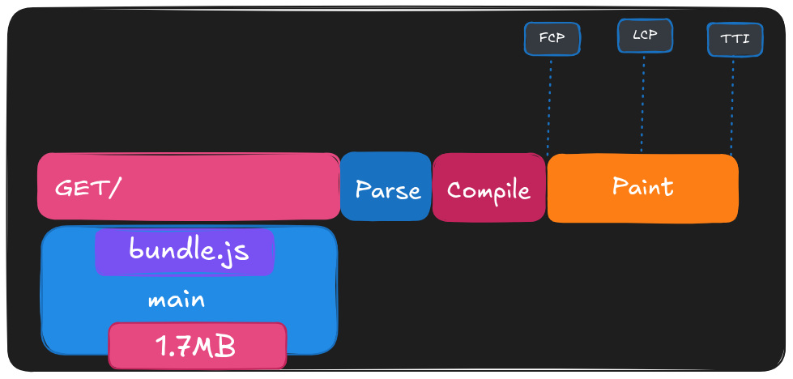
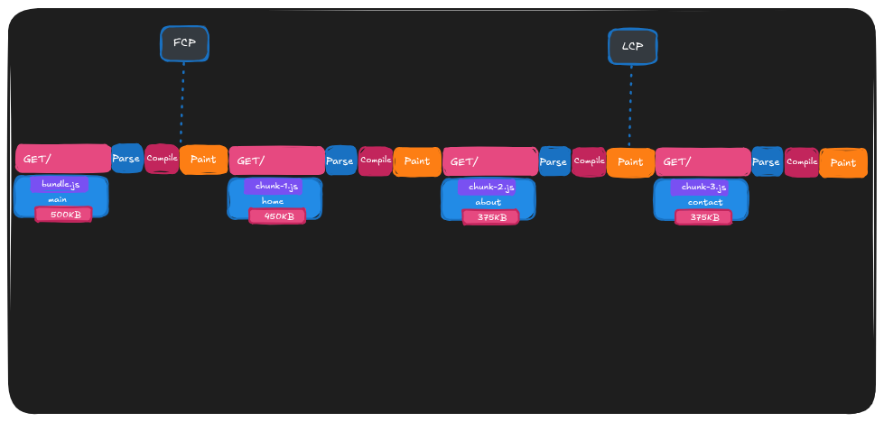

## Bundle Splitting nima?

import { Badge } from "@astrojs/starlight/components";

Zamonaviy web applicationlar yaratishda <Badge variant="tip" text="Webpack" /> yoki <Badge variant="tip" text="Rollup" /> kabi <Badge text="bundler" />lar ilovaning <Badge variant="caution" text="source code" />ini olib, uni bitta yoki bir nechta <Badge text="bundle" />larga yig‘adi. Foydalanuvchi websaytga kirganda, ushbu bundle so‘raladi va yuklanadi, shundan so‘ng ma’lumotlar foydalanuvchi ekranida ko‘rsatiladi.

**Bundler** bir `entry` file qabul qiladi va shu fayldan codeni bundle qilishni boshlaydi. Agar biz boshqa fayllardan modulelarni `import` qilgan bo‘lsak, bundler ushbu modulelarga kirib chiqadi va ularni ham bundlega qo‘shadi.

**V8** kabi JavaScript **engine**lar foydalanuvchi tomonidan so‘ralgan data yuklanish jarayonining o‘zida uni <Badge text="parse" /> va <Badge text="compile" /> qila oladi. Garchi zamonaviy browserlar codeni imkon qadar tez va performant tarzda parse va compile qilish darajasiga yetgan bo‘lsa ham, jarayonning ikki muhim bosqichini optimizatsiya qilish baribir developer zimmasida qoladi: **loading time** va **execution time**. Biz execution timeni imkon qadar qisqa saqlashimiz kerak, chunki u **main thread**ni bloklab qo‘ymasligi lozim.

Zamonaviy browserlar bundleni kelib tushishi bilan **stream** qila olsa ham, foydalanuvchi qurilmasida birinchi **pixel** chizilishidan (paint) oldin baribir sezilarli vaqt o‘tishi mumkin. Bundle qanchalik katta bo‘lsa, engine birinchi rendering call yozilgan qatorgacha yetib borishi shunchalik ko‘p vaqt oladi. Shu vaqtgacha foydalanuvchi bo‘sh (blank) ekranga qarab kutib o‘tirishga majbur bo‘ladi — bu esa juda ham asabiylashtiruvchi holat bo‘lishi mumkin.



Biz foydalanuvchiga ma’lumotni iloji boricha tezroq ko‘rsatishni xohlaymiz. Katta **bundle** yuklanish va **processing** hamda **execution** vaqtini oshiradi. Shu bundlening hajmini kamaytirish orqali ish tezligini oshirish juda foydali bo‘ladi.

Keraksiz codeni o‘z ichiga olgan bitta katta bundle so‘rash o‘rniga, biz uni bir nechta kichik bundle’larga bo‘lishimiz mumkin!



## Bundle Splitting Turlari

- **Route-based Splitting**: Har bir sahifa (route) uchun alohida bundle yaratiladi. Foydalanuvchi qaysi sahifaga kirsa, faqat o'sha sahifaning kodi yuklanadi.
- **Component-based Splitting**: Katta yoki kam ishlatiladigan komponentlarni alohida bundle qilib ajratish. Masalan, modal oynalar, charlar, yoki murakkab formalar.
- **Vendor Splitting (Kutubxonalarni ajratish)**: Uchinchi tomon kutubxonalarini (vendor libraries) alohida bundle qilish. Bu kutubxonalar kamdan-kam o'zgaradi, shuning uchun browser cache'ida uzoq saqlanishi mumkin. Quyidagi misolda `react` va `react-dom` kutubxonalari alohida `vendor` nomli faylga ajratiladi.

```javascript
// vite.config.js
import { defineConfig } from "vite";

export default defineConfig({
  build: {
    rollupOptions: {
      output: {
        manualChunks: {
          vendor: ["react", "react-dom"],
        },
      },
    },
  },
});
```

import { Aside } from "@astrojs/starlight/components";

<Aside type="tip" title="Pros">
  <div>
    **Tez yuklanish**: Foydalanuvchi faqat kerakli kodni yuklaydi, bu sahifa
    yuklanish vaqtini qisqartiradi
  </div>
  <div>
    **Yaxshi cache**: Alohida bundlelar browser cache ida mustaqil saqlanadi,
    o'zgarishlar bo'lganda faqat tegishli qism qayta yuklanadi
  </div>
  <div>
    **Paralel yuklash**: Bir nechta kichik fayllar bir vaqtning o'zida
    yuklanishi mumkin
  </div>
  <div>
    **Foydalanuvchi tajribasi**: Sahifa tezroq interaktiv bo'ladi, foydalanuvchi
    kutish vaqti kamayadi
  </div>
  <div>
    **Resurslarga tejamkorlik**: Mobil qurilmalarda va sekin internet
    aloqalarida ayniqsa foydali
  </div>
</Aside>
